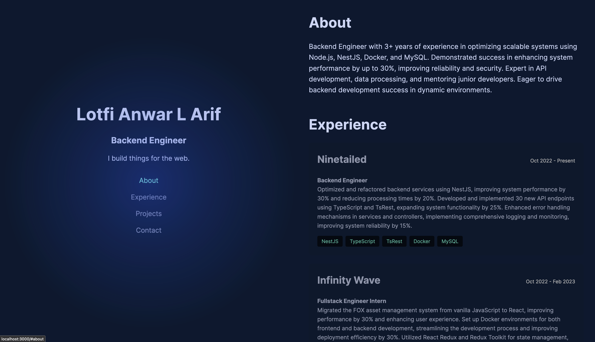

# Portfolio Website



## Overview

This is my personal portfolio website, built to showcase my projects, experience, and contact information. The website is built using modern web technologies and follows responsive design principles to ensure it looks great on all devices.

## Features

- **Responsive Design:** The layout adjusts beautifully across various screen sizes.
- **Dynamic Content:** Sections like Experience and Projects are dynamically rendered.
- **Interactive UI:** Hover effects and transitions for a smooth user experience.
- **Accessibility:** Accessible design practices to ensure usability for everyone.

## Built With

- **React:** JavaScript library for building user interfaces.
- **Next.js:** React framework for server-side rendering and static site generation.
- **Sass:** CSS preprocessor for writing maintainable styles.
- **FontAwesome:** Icon library for beautiful icons.

## How to Use

1. **Clone the repository:**

   ```bash
   git clone git@github.com:Lotfi-Arif/portfolio-frontend.git
   cd portfolio-frontend
   ```

2. **Install dependencies:**

   ```bash
   yarn
   ```

3. **Run the development server:**

   ```bash
   yarn run dev
   ```

4. **Build for production:**
   ```bash
   yarn run build
   yarn start
   ```

## Sections

### About

A brief introduction about me, my skills, and my professional journey.

### Experience

A list of my work experiences with detailed descriptions, roles, and durations. The cards are interactive, displaying more information on hover.

### Projects

Showcase of my projects with images, descriptions, and technologies used. Each project card links to the project details or GitHub repository.

### Contact

My contact information, including email, GitHub, LinkedIn, Twitter, and Instagram. Each contact card includes an icon and a link.

## Contributing

Feel free to fork this repository, make improvements, and submit a pull request. Any contributions are greatly appreciated!

